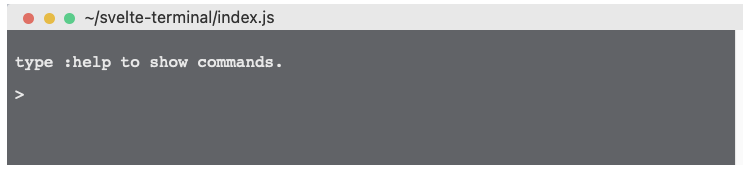

### svelte-terminal

this is a terminal-like html console window.
you can write your own command.

#### screenshot

### todo list

- [] round layout
- [] customize theme
- [] customize title
- [] customize command
- [] fix layout
- [] fix font
- [] fix input shake issue
- [] add hightlight if possible

**still on work, not usable**